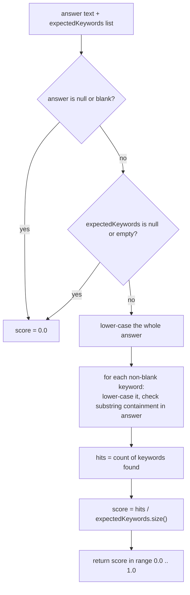
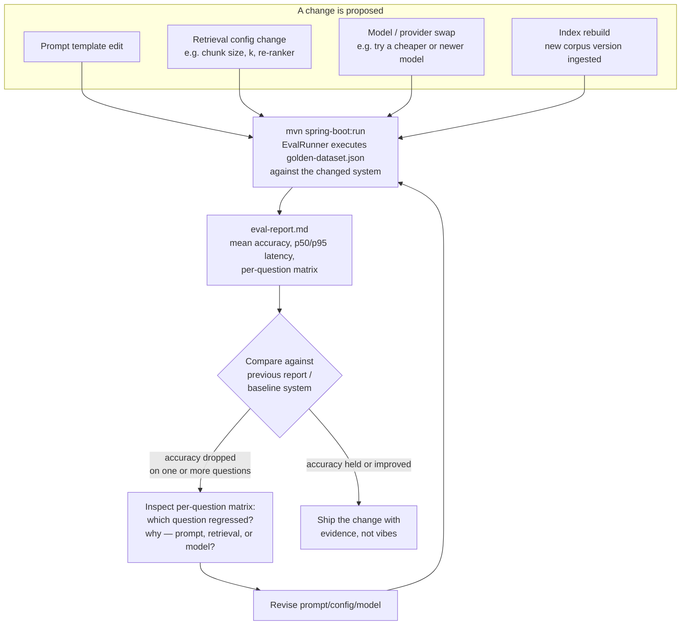

# llm-eval — Golden-Dataset Evaluation Harness


`llm-eval` is a small, deliberately boring Spring Boot CLI application with one job: ask the same
set of questions to every retrieval system in this workspace, score the answers, and produce a
markdown report that says — objectively, repeatably, and without a human re-reading five chat
transcripts — which system is actually better today.

It exists because "the demo looked good" is not a regression test, and because comparing LLM-backed
systems by eyeballing chat transcripts does not scale past the second system, let alone four.

| System under test            | Repo                          | Endpoint                    |
|-------------------------------|--------------------------------|------------------------------|
| Vector RAG (OpenSearch kNN)    | `llm-rag/llm-rag-pipeline`     | `POST /api/v1/generate`      |
| Vectorless RAG (BM25/PageIndex)| `llm-rag/llm-rag-vectorless`   | `POST /api/rag/chat`         |
| Graph RAG (Neo4j)              | `llm-rag/llm-rag-graph`        | `POST /api/v1/rag/query`     |
| OKF (LLM index navigation)     | `llm-OKF/okf-chat`             | `POST /api/v1/okf/chat`      |

This document goes well beyond "how to run it." It explains *why* evaluating LLM output is a
genuinely hard problem, what scoring strategy this repo has chosen (and why), how the runner is
built so it can't be taken down by a single flaky dependency, and where this harness sits inside a
realistic LLM development lifecycle.

---

## Table of contents

1. 🤖 [Why evaluating LLM output is hard](#why-evaluating-llm-output-is-hard)
2. 🔹 [The scoring methodology this repo implements](#the-scoring-methodology-this-repo-implements)
3. 🔀 [Architecture: how `EvalRunner` orchestrates an evaluation run](#architecture-how-evalrunner-orchestrates-an-evaluation-run)
4. 🏷️ [The eval pipeline, end to end](#the-eval-pipeline-end-to-end)
5. 🤖 [Configuration model — `EvalProperties`](#configuration-model--evalproperties)
6. 🔹 [The golden dataset](#the-golden-dataset)
7. 🔹 [The generated report](#the-generated-report)
8. 🛡️ [Failure handling and resilience](#failure-handling-and-resilience)
9. 🤖 [Where this fits in an LLM development workflow](#where-this-fits-in-an-llm-development-workflow)
10. 🚀 [Running it](#running-it)
11. 🔹 [Extending the dataset](#extending-the-dataset)
12. 🔹 [Known limitations and natural next steps](#known-limitations-and-natural-next-steps)
13. 🏗️ [Project layout](#project-layout)

---

## Why evaluating LLM output is hard

Testing a deterministic function is easy: give it an input, assert on the exact output. Testing an
LLM-backed system is not, for a few compounding reasons that this harness's design directly reacts
to.

**1. Non-determinism.** The same question, sent to the same system, at temperature > 0 (or even at
temperature 0 with a model that isn't perfectly reproducible across provider-side changes), can
produce two answers that differ in wording, structure, and length while agreeing on every fact that
matters. A test suite that does `assertEquals(expected, actual)` on generated text will flake
constantly and teaches nobody anything about actual quality.

**2. There is no single "correct" answer.** "Which relational database do the services use and
which version?" can be correctly answered as "Postgres 18", "We're on PostgreSQL version 18", or
"The services run against a PostgreSQL 18 instance." All three are equally right. Any scoring
mechanism that requires string equality with one golden answer will mark two of those three wrong.

**3. Quality is graded, not binary.** An answer can be partially correct — it names the database
but gets the version wrong, or vice versa. A pass/fail test throws away that signal. A regression
where a system starts getting the version wrong but keeps naming the database correctly should show
up as a partial score drop, not a silent binary flip.

**4. Systems fail independently and often mid-comparison.** When you're evaluating four different
services (vector RAG, vectorless RAG, graph RAG, OKF) side by side, the odds that all four are up
and healthy at the exact moment you run the comparison are low. An evaluation harness that crashes
the whole run because one target returned a connection refused is worse than useless — it means you
never get a report on the systems that *were* healthy.

**5. You need a rubric, not a vibe.** The only way to make "system A is better than system B" a
claim you can defend (and re-check after a prompt change, a model swap, or a re-index) is to fix a
rubric in advance: a concrete, mechanical rule for what counts as a correct answer to each question,
applied identically and repeatedly to every system. That rubric is the golden dataset's
`expectedKeywords`, and applying it deterministically is `AnswerScorer`'s entire job.

This repo answers each of those problems with a specific, deliberate design choice:

| Problem                                   | Design response in this repo |
|--------------------------------------------|-------------------------------|
| Non-determinism in generated text          | Score on presence of required facts (keywords), not exact string match |
| No single correct answer                   | Golden dataset encodes *facts that must appear*, not one canonical sentence |
| Partial correctness                        | Score is a continuous fraction in `[0, 1]` (keyword recall), not pass/fail |
| Comparing several systems, some inevitably down | `EvalRunner` catches per-question failures and scores them 0 with an `unavailable` marker instead of aborting |
| Need for a fixed, repeatable rubric        | `golden-dataset.json` is checked into the repo and versioned like code |

---

## The scoring methodology this repo implements

The entire scoring engine lives in one file, `AnswerScorer`
(`src/main/java/com/org/llm/eval/AnswerScorer.java`), and it implements exactly one strategy:
**keyword recall** — the fraction of an answer's *expected keywords* that appear as
case-insensitive substrings of the model's answer text.

```java
static double score(String answer, List<String> expectedKeywords) {
    if (answer == null || answer.isBlank() || expectedKeywords == null || expectedKeywords.isEmpty()) {
        return 0;
    }
    String haystack = answer.toLowerCase(Locale.ROOT);
    long hits = expectedKeywords.stream()
            .filter(k -> k != null && !k.isBlank())
            .filter(k -> haystack.contains(k.toLowerCase(Locale.ROOT)))
            .count();
    return (double) hits / expectedKeywords.size();
}
```

This is deliberately the simplest scorer that could possibly work, and that simplicity is the
point: it is **fully deterministic** (no LLM call, no sampling, no cost, no rate limit), **fast**
(a handful of substring scans), and **CI-friendly** (no network dependency, no API key, no
flakiness introduced by the *scorer itself* — any non-determinism in a report comes only from the
systems under test, never from the grading step). The class is `final` with a private constructor:
it's a pure static utility, not something you're meant to subclass or configure.

`AnswerScorerTest` (`src/test/java/com/org/llm/eval/AnswerScorerTest.java`) pins down the exact
scoring rules with five cases, which double as the specification:

| Test | Rule being pinned down |
|---|---|
| `fullRecallScoresOne` | All expected keywords present → score `1.0` |
| `partialRecallScoresFraction` | Half of two expected keywords present → score exactly `0.5` (score is `hits / expectedKeywords.size()`, not a rounded/binned value) |
| `matchIsCaseInsensitive` | `"PROMETHEUS and Grafana"` matches keywords `"prometheus"`, `"grafana"` — matching lower-cases both sides |
| `blankAnswerScoresZero` | A blank string (`"  "`) *or* a `null` answer both score `0`, never throw |
| `emptyKeywordListScoresZero` | A question with an empty `expectedKeywords` list scores `0` even given a non-empty answer — an unscoreable question never accidentally rewards a system with a perfect score by vacuous truth |

That last rule is easy to get wrong (mathematically, "0 of 0 keywords found" could just as validly
be treated as 100% recall) and the test exists specifically to lock in the safer choice: an
ill-specified golden question should never silently inflate a system's mean accuracy.

Note what the scorer explicitly does **not** do, by design, per its own class-level Javadoc comment:

> Deliberately simple and deterministic — it needs no LLM and can run in CI. Swap in an
> LLM-as-judge scorer once relative rankings need finer resolution.

In other words: keyword recall is the floor, not the ceiling. It cannot detect *fluent nonsense*
that happens to mention the right nouns, it cannot penalize verbosity or hedging, and it cannot
reward an answer that expresses the same fact with a synonym the keyword list didn't anticipate
(e.g., an answer that says "PSQL" instead of "postgres" scores a miss even though a human grader
would call it correct). Substring matching is also not word-boundary aware, so a keyword like `"sql"`
would match inside `"postgresql"` — the dataset curator is responsible for choosing keywords that
are specific enough not to produce accidental matches (see [Extending the
dataset](#extending-the-dataset)). Those are accepted, documented trade-offs in exchange for a
scorer that has zero moving parts to go wrong and produces the same number every time it's given
the same answer.

### Scoring decision flow



### Why keyword recall over the alternatives

| Alternative scoring strategy | Why it was not chosen here (yet) |
|---|---|
| Exact string match | Fails on any paraphrase; would score almost every real LLM answer as wrong |
| Edit distance / fuzzy string similarity | Penalizes verbose-but-correct answers; rewards short-but-wrong answers that happen to share characters with the golden text |
| Embedding cosine similarity | Requires an embedding model call per answer (cost, latency, another moving part to keep deterministic across runs); harder to reason about *why* a score changed |
| LLM-as-judge | Highest ceiling on nuance, but non-deterministic itself (another LLM call), costs money/tokens per evaluation, and needs its own prompt to be evaluated and versioned — explicitly called out in the code as "the natural upgrade when finer resolution is needed," not the current implementation |
| **Keyword recall (implemented)** | Deterministic, free, instant, CI-safe; trades nuance for repeatability |

---

## Architecture: how `EvalRunner` orchestrates an evaluation run

`EvalRunner` (`src/main/java/com/org/llm/eval/EvalRunner.java`) is a Spring
`CommandLineRunner` — it is not a web controller and the app itself boots with
`WebApplicationType.NONE` (see `LlmEvalApplication`). This is a batch job with a `main` method, not
a service you call: you run it, it runs to completion, it writes a file, it exits. That shape
matches its purpose — a CI-style regression check, not an interactive service.

At a high level, `run(String... args)` does exactly four things, in order:

1. **Load the golden dataset** — deserialize `golden-dataset.json` (classpath resource, path
   configurable) into a `List<GoldenQuestion>` via Jackson's `ObjectMapper`.
2. **Evaluate the full cross-product** — for every configured `SystemUnderTest`, for every
   `GoldenQuestion`, call `evaluate(...)` and collect a `Result`.
3. **Render a markdown report** — aggregate the flat list of `Result` records into a summary table
   (one row per system) plus a per-question accuracy matrix.
4. **Write the report to disk** — at `properties.reportPath()` (`eval-report.md` by default).

### The generic REST adapter (no code needed per system)

The `EvalRunner` doesn't have four hard-coded HTTP clients, one per RAG variant. Instead each system
under test is described generically by `EvalProperties.SystemUnderTest`:

```java
public record SystemUnderTest(
        String name,
        String url,
        String questionField,
        String answerField,
        Map<String, String> headers) {}
```

`evaluate(...)` builds a JSON request body of `{ questionField: question.question() }`, POSTs it to
`url` (attaching any static `headers`, e.g. API keys), and reads the answer back out of the response
JSON at `answerField` using Jackson's `JsonNode` path navigation:

```java
JsonNode node = objectMapper.readTree(body).path(system.answerField());
String answer = node.isMissingNode() ? "" : node.asText("");
```

This is the reason the README's system table can list four completely different services (vector
RAG on OpenSearch, BM25 vectorless RAG, Neo4j graph RAG, and OKF's LLM-driven index navigation) that
speak different request/response shapes, without a single line of Java changing per system — see
`application.yaml`, where each entry is purely configuration:

```yaml
eval:
  systems:
    - name: rag-pipeline (vector)
      url: ${RAG_PIPELINE_URL:http://localhost:8081}/api/v1/generate
      question-field: query
      answer-field: answer
    - name: rag-vectorless (BM25)
      url: ${RAG_VECTORLESS_URL:http://localhost:8092}/api/rag/chat
      question-field: question
      answer-field: answer
    - name: rag-graph (Neo4j)
      url: ${RAG_GRAPH_URL:http://localhost:8093}/api/v1/rag/query
      question-field: question
      answer-field: answer
    - name: okf (index navigation)
      url: ${OKF_URL:http://localhost:8090}/api/v1/okf/chat
      question-field: question
      answer-field: answer
```

Adding a fifth system to compare — a new prompt variant behind a new endpoint, say — is a
four-line YAML addition, never a Java change. That genericity is exactly what makes this a *harness*
rather than four bespoke test classes.

### Per-question result shape

Every single (system, question) evaluation produces one immutable record:

```java
record Result(String system, String questionId, double accuracy, long latencyMs,
              int answerChars, String error) {}
```

`EvalRunner` accumulates a flat `List<Result>` across the entire cross-product (`systems.size() *
dataset.size()` entries) and only aggregates it once, at report-rendering time — there is no
running/streaming aggregation, which keeps the orchestration loop simple and side-effect-free until
the very end.

---

## The eval pipeline, end to end

```mermaid
flowchart LR
    subgraph Input
        GD[golden-dataset.json\nList of GoldenQuestion]
        CFG[application.yaml\nEvalProperties: systems, timeouts, paths]
    end

    subgraph EvalRunner [EvalRunner.run]
        LOAD[loadDataset\nJackson deserialize] --> LOOP{{for each system\n  for each question}}
        LOOP --> CALL[HTTP POST question\nvia RestClient]
        CALL -->|2xx JSON body| EXTRACT[extract answer\nvia answer-field JsonNode path]
        CALL -->|exception / timeout| FAIL[catch exception\nResult accuracy=0, error=message]
        EXTRACT --> SCORE[AnswerScorer.score\nkeyword recall]
        SCORE --> RESULT[Result: system, questionId,\naccuracy, latencyMs, answerChars, error=null]
        FAIL --> RESULTS[(List of Result)]
        RESULT --> RESULTS
    end

    subgraph Reporting
        RESULTS --> AGG[renderReport:\nmean accuracy per system\np50 / p95 latency per system\nmean answer length\nerror counts]
        AGG --> MATRIX[per-question accuracy matrix\none row per question,\none column per system]
        AGG --> WRITE[Files.writeString]
        MATRIX --> WRITE
        WRITE --> REPORT[(eval-report.md)]
    end

    GD --> LOAD
    CFG --> LOOP
    CFG --> CALL

    style REPORT fill:#2b6,stroke:#333,color:#000
```



Walking that diagram left to right in prose:

1. **Dataset and configuration load.** `golden-dataset.json` becomes a typed
   `List<GoldenQuestion>`; `application.yaml` (bound to `EvalProperties` via
   `@ConfigurationProperties(prefix = "eval")` and `@ConfigurationPropertiesScan`) supplies the list
   of systems, the dataset path, the report path, and the request timeout.
2. **Nested iteration, not parallel fan-out.** `EvalRunner` iterates systems in the outer loop and
   questions in the inner loop, sequentially. There is no concurrency here today — see [Known
   limitations](#known-limitations-and-natural-next-steps) — which means total wall-clock time for a
   run is roughly `systems × questions × per-call latency`, and one very slow system delays the
   whole run (though it can never abort it; see below).
3. **One bounded HTTP call per (system, question) pair.** A single shared `RestClient` (built once
   per run in `buildClient()`) issues the POST. Both connect timeout (fixed at 5s) and read timeout
   (configurable, default 30s, via `eval.request-timeout-seconds`) are enforced by a
   `JdkClientHttpRequestFactory`, so a single hung backend can only ever cost the run
   `request-timeout-seconds`, never hang it indefinitely.
4. **Success path: extract → score.** On a 2xx response, the configured `answer-field` is pulled
   out of the JSON body (defensively — a missing field becomes `""`, not a `NullPointerException`),
   and `AnswerScorer.score(...)` converts `(answer, expectedKeywords)` into a `[0,1]` accuracy value.
5. **Failure path: catch → zero-score with reason.** Any `Exception` — connection refused, timeout,
   malformed JSON, non-2xx status raised by `RestClient`'s default error handling — is caught per
   question, logged at `WARN`, and converted into a `Result` with `accuracy = 0` and `error` set to
   the exception message. Crucially, this happens *inside* the per-question `evaluate(...)` call, so
   one exception affects exactly one cell of the final matrix, never the whole run.
6. **Aggregation, once, at the end.** `renderReport(...)` walks the configured systems, filters the
   flat `Result` list per system, and computes: mean accuracy (simple average of `accuracy` across
   that system's questions), p50 and p95 latency (via the `percentile(...)` helper — see below),
   mean answer length in characters, and a raw count of `error != null` rows.
7. **Two tables, one file.** The report is a single markdown document: a summary table (one row per
   system, columns for mean accuracy / p50 / p95 / mean chars / errors) followed by a per-question ×
   per-system accuracy matrix, where any question a system failed shows the literal string
   `unavailable` instead of a number.

### The percentile helper

Latency percentiles are computed by a small, independently unit-tested static method:

```java
static long percentile(List<Long> sortedAscending, int pct) {
    if (sortedAscending.isEmpty()) return 0;
    int index = (int) Math.ceil(pct / 100.0 * sortedAscending.size()) - 1;
    return sortedAscending.get(Math.clamp(index, 0, sortedAscending.size() - 1));
}
```

`EvalRunnerTest` (`src/test/java/com/org/llm/eval/EvalRunnerTest.java`) pins down its edge cases:
an empty list returns `0` rather than throwing; for ten latencies `10..100`, p50 lands on `50` and
both p95 and p100 land on `100` (the "nearest-rank" method, rounding the target rank up); and a
single-element list returns that element regardless of which percentile is asked for. This is the
same nearest-rank percentile definition commonly used for latency SLOs (as opposed to
linear-interpolation percentiles), which matters if these numbers are ever compared against
percentiles reported by other tooling.

---

## Configuration model — `EvalProperties`

Everything the runner needs to know about *what to evaluate* and *where results go* is a single
`@ConfigurationProperties(prefix = "eval")` record, bound automatically at startup by
`@ConfigurationPropertiesScan` (declared on `LlmEvalApplication`, so no explicit `@Bean` wiring is
needed):

```java
public record EvalProperties(
        String datasetPath,
        String reportPath,
        int requestTimeoutSeconds,
        List<SystemUnderTest> systems) {

    public record SystemUnderTest(
            String name,
            String url,
            String questionField,
            String answerField,
            Map<String, String> headers) {}
}
```

| Property | Meaning | Default (`application.yaml`) |
|---|---|---|
| `eval.dataset-path` | Classpath or filesystem location of the golden dataset | `classpath:golden-dataset.json` |
| `eval.report-path` | Where the markdown report is written | `${EVAL_REPORT_PATH:eval-report.md}` |
| `eval.request-timeout-seconds` | Per-call HTTP read timeout | `${EVAL_REQUEST_TIMEOUT_SECONDS:30}` |
| `eval.systems[].name` | Display name used in report tables | — |
| `eval.systems[].url` | Full endpoint URL (env-var overridable per system, e.g. `RAG_PIPELINE_URL`) | — |
| `eval.systems[].question-field` | JSON field name the target expects the question in | — |
| `eval.systems[].answer-field` | JSON field name the target's response carries the answer in | — |
| `eval.systems[].headers` | Optional static headers (e.g. API keys) | none |

Because every system-specific detail is externalized to YAML/environment variables, comparing a
fifth candidate system — or re-pointing an existing one at a different deployment (staging vs.
local, a canary build, etc.) — never requires touching `EvalRunner.java`.

---

## The golden dataset

`src/main/resources/golden-dataset.json` is the rubric — the fixed, versioned set of questions and
the facts a correct answer to each one must contain. Each entry deserializes into a
`GoldenQuestion`:

```java
public record GoldenQuestion(String id, String question, List<String> expectedKeywords) {}
```

The dataset shipped in this repo has five starter questions, each targeting a different aspect of a
fictional internal knowledge base that all four RAG/OKF systems are presumably indexing:

| id | question | expectedKeywords |
|---|---|---|
| `q1-departments` | Which departments exist in the company and who leads engineering? | `engineering`, `department` |
| `q2-tech-stack` | What technologies does the platform team use for observability? | `prometheus`, `grafana` |
| `q3-database` | Which relational database do the services use and which version? | `postgres`, `18` |
| `q4-auth` | How are the internal APIs authenticated? | `keycloak`, `oauth` |
| `q5-rag-approach` | How does the retrieval pipeline decide which documents are relevant to a query? | `embedding`, `vector` |

Two things worth calling out about this dataset as written:

- It is explicitly a **starter/placeholder** dataset (per the original authoring intent) — the
  questions are grounded in a fictional corpus, not a specific real one. Anyone adopting this
  harness for real is expected to replace these five entries with questions grounded in whatever
  corpus is actually loaded into the vector/graph/BM25 indexes being compared, or the "accuracy"
  numbers in the report describe nothing meaningful.
- `q3-database`'s keyword `"18"` is a good illustration of the substring-matching caveat discussed
  above: it will match "Postgres 18", but it would *also* match inside an unrelated number like
  "180" or a date. Short, generic keywords like bare version numbers are exactly the case where
  keyword recall's simplicity shows its cost.

---

## The generated report

Every run overwrites `eval-report.md` (or wherever `eval.report-path` points) with a fresh
timestamped document. A prior run's output, checked in at the repo root, shows the shape concretely
(all four target systems were down when it was generated, which is exactly the scenario the
`unavailable` handling exists for):

```
# LLM Retrieval Systems — Evaluation Report

Generated: 2026-07-01T21:08:23.255124941Z
Questions: 5

| System | Mean accuracy | p50 latency (ms) | p95 latency (ms) | Mean answer chars | Errors |
|---|---|---|---|---|---|
| rag-pipeline (vector) | 0.00 | 0 | 33 | 0 | 5 |
| rag-vectorless (BM25) | 0.00 | 0 | 0 | 0 | 5 |
| rag-graph (Neo4j) | 0.00 | 0 | 0 | 0 | 5 |
| okf (index navigation) | 0.00 | 30001 | 30002 | 0 | 5 |

## Per-question accuracy

| Question | rag-pipeline (vector) | rag-vectorless (BM25) | rag-graph (Neo4j) | okf (index navigation) |
|---|---|---|---|---|
| q1-departments | unavailable | unavailable | unavailable | unavailable |
| q2-tech-stack | unavailable | unavailable | unavailable | unavailable |
| q3-database | unavailable | unavailable | unavailable | unavailable |
| q4-auth | unavailable | unavailable | unavailable | unavailable |
| q5-rag-approach | unavailable | unavailable | unavailable | unavailable |
```

Reading this sample report is itself instructive about the resilience design: the `okf` row shows
p50/p95 latencies around 30000ms — that's the configured `request-timeout-seconds` (30s) being hit
on every single question, meaning `okf-chat` was reachable enough to accept the TCP connection but
never responded before the read timeout expired. The other three systems show near-zero latency,
consistent with an immediate connection refusal (nothing listening on the port at all). Both
failure modes are captured, distinguished by latency, and neither one crashes the run — every system
still gets its full five-question row in the matrix, all correctly marked `unavailable` rather than
silently omitted.

---

## Failure handling and resilience

Resilience is not bolted on after the fact here — it's structural, built from three small decisions
that compound:

1. **Per-question try/catch, not per-run.** The `try { ... } catch (Exception e) { ... }` inside
   `evaluate(...)` wraps a single HTTP call for a single question against a single system. A crash
   anywhere in that path — DNS failure, connection refused, socket timeout, a non-2xx status thrown
   by `RestClient`, malformed JSON from `objectMapper.readTree(body)` — degrades to exactly one
   `Result` row with `accuracy = 0` and a populated `error` message. It can never propagate up and
   abort the outer double loop.
2. **Bounded timeouts on every call.** `buildClient()` constructs one `RestClient` per run with an
   explicit 5-second connect timeout and a configurable (default 30s) read timeout, via
   `JdkClientHttpRequestFactory`. Without this, a target that accepts a TCP connection and then never
   responds (rather than actively refusing it) would hang the evaluation indefinitely on default
   JDK HTTP client settings. This is precisely the `okf` behavior visible in the sample report above.
3. **Defensive JSON field extraction.** `node.isMissingNode() ? "" : node.asText("")` means a system
   that returns a differently-shaped JSON body (say, the configured `answer-field` doesn't exist in
   a particular response) degrades to an empty-string answer — which `AnswerScorer` scores as `0` —
   rather than throwing a `NullPointerException` that would otherwise be caught by the same
   try/catch anyway, but with a less informative error message.

The net effect: **a comparison run against four systems where three are down and one is healthy
still produces a complete, correctly-labeled report** — which is exactly the situation an engineer
doing local development (with only one of four services running) will be in most of the time.

---

## Where this fits in an LLM development workflow

A harness like this earns its keep once you treat prompts, retrieval configuration, and even model
choice as things that can regress — the same way a code change can regress a unit test. The natural
place `llm-eval` sits is as a **golden-dataset regression gate**, run at meaningful checkpoints
rather than continuously:



Concretely, this maps onto familiar software-engineering habits:

- **It's a regression test for prompts.** Changing a system prompt or a few-shot example is exactly
  as risky as changing application logic — it can silently break behavior that used to work. Running
  the golden dataset before and after a prompt edit turns "I think that phrasing tweak was safe" into
  a diffable, question-by-question accuracy comparison.
- **It's a regression test across model swaps.** Because every system is described generically
  (`url` / `question-field` / `answer-field`), pointing the `rag-pipeline` entry at a build that
  swapped its underlying LLM (a cheaper model, a newer version, a different provider) costs a
  one-line config change, and the resulting report is directly comparable to the previous one.
- **It's a comparison tool across architectures**, which is the table at the top of this README:
  four fundamentally different retrieval strategies (dense vector kNN, sparse BM25/PageIndex, graph
  traversal, LLM-driven index navigation) answering the *same* fixed question set lets you make an
  actual architecture decision (which retrieval strategy to invest further in) backed by numbers
  instead of anecdote.
- **It's cheap enough to run often.** Because scoring is keyword recall rather than an LLM judge, a
  run costs nothing beyond the target systems' own inference cost and completes in roughly
  `systems × questions × latency` — there's no reason not to run it after every meaningful change,
  the same way you'd run a fast unit test suite.
- **The per-question matrix is the debugging tool, not the summary row.** A mean-accuracy number
  tells you *that* something changed; the per-question × per-system matrix tells you *which*
  specific question regressed, which is usually enough to guess *why* (a keyword that depends on a
  fact that moved to a different chunk after a re-index, a prompt tweak that made the model more
  terse and drop a fact it used to state explicitly, and so on).
- **It is intentionally not the last word on quality.** Keyword recall answers "did the system say
  the required facts," not "is this a good, well-written, appropriately-hedged answer." Teams that
  need that finer signal are expected to graduate to an LLM-as-judge scorer for a subset of
  high-value questions, layered on top of (not instead of) this fast deterministic check — exactly
  the upgrade path the `AnswerScorer` Javadoc calls out.

---

## Running it

```bash
# start whichever target systems you want to compare, then:
mvn spring-boot:run

# override system URLs / report location / timeout via environment variables:
RAG_PIPELINE_URL=http://localhost:8081 \
RAG_VECTORLESS_URL=http://localhost:8092 \
RAG_GRAPH_URL=http://localhost:8093 \
OKF_URL=http://localhost:8090 \
EVAL_REPORT_PATH=/tmp/report.md \
EVAL_REQUEST_TIMEOUT_SECONDS=30 \
mvn spring-boot:run
```

The application boots with `WebApplicationType.NONE` (see `LlmEvalApplication`) — it is a one-shot
CLI run, not a long-lived server. It loads the dataset, evaluates every system, writes the report,
logs where the report landed, and exits. Systems that are unreachable or too slow score `0` and are
marked `unavailable` in the per-question matrix; the run itself never aborts because of them.

To run just the unit tests (which cover `AnswerScorer`'s scoring rules and `EvalRunner`'s percentile
math, with no network calls involved at all):

```bash
mvn test
```

---

## Extending the dataset

Add entries to `src/main/resources/golden-dataset.json`:

```json
{
  "id": "q6-my-topic",
  "question": "…",
  "expectedKeywords": ["fact-a", "fact-b"]
}
```

Guidelines that follow directly from how `AnswerScorer` works:

- **Keep keywords short, factual, and unambiguous.** They are matched as case-insensitive
  *substrings*, not tokenized words and not semantically matched — a keyword like `"sql"` will match
  inside `"postgresql"`, and a keyword like `"18"` will match inside `"180"`. Prefer keywords
  specific enough that an accidental substring hit is implausible in this corpus.
- **Every keyword should be independently verifiable** from the corpus you're actually querying —
  don't encode a fact the indexed documents don't state.
- **Prefer 2–4 keywords per question.** Too few and the score becomes coarse (a single keyword
  makes every question a 0/1 pass-fail, defeating the point of a fractional score); too many and a
  system that gives a terse-but-correct answer gets unfairly penalized for not restating every
  synonym of the same fact.
- **Replace the placeholder dataset for real use.** The five questions shipped here are grounded in
  a fictional corpus for demonstration. For the comparison to mean anything, replace them with
  questions grounded in the corpus that is actually ingested into the vector/graph/BM25 indexes and
  the OKF index being compared.

---

## Known limitations and natural next steps

Being explicit about what this harness does *not* do is as useful as documenting what it does:

- **Sequential execution.** Systems and questions are evaluated in a nested loop with no
  concurrency; total run time scales linearly with `systems × questions`. Parallelizing across
  systems (each is an independent HTTP target) is a natural, low-risk optimization if the dataset or
  system count grows.
- **No historical trend tracking.** Each run overwrites `eval-report.md` in place; nothing here
  diffs today's report against yesterday's or plots accuracy over time. Pairing this with version
  control (commit the report, or timestamp report filenames) is how a team gets a regression trend
  rather than a single snapshot.
- **Keyword recall has a hard ceiling on nuance**, as discussed at length above — it cannot detect
  confidently-wrong answers that happen to mention the right nouns, cannot penalize verbosity, and
  is sensitive to keyword choice quality. The documented upgrade path is an LLM-as-judge scorer for
  cases where finer resolution is worth the added cost and non-determinism.
- **No statistical significance testing.** A mean accuracy of `0.80` vs `0.76` across five questions
  is not a claim any statistical test backs up — the dataset here is a five-question starter. A
  larger, more diverse golden dataset is a prerequisite for treating small accuracy deltas as
  meaningful rather than noise.

---

## Project layout

```
src/main/java/com/org/llm/eval/
  LlmEvalApplication.java   Boot entry point; WebApplicationType.NONE; @ConfigurationPropertiesScan
  EvalRunner.java           CommandLineRunner: orchestrates the eval loop, scores, renders + writes the report
  EvalProperties.java       @ConfigurationProperties(prefix = "eval") — systems, dataset path, report path, timeout
  GoldenQuestion.java       record(id, question, expectedKeywords) — one dataset entry
  AnswerScorer.java         Pure static keyword-recall scorer — the entire grading rubric

src/main/resources/
  application.yaml          Default system endpoints, dataset/report paths, timeout
  golden-dataset.json       The versioned rubric: questions + required facts per question
  banner.txt                Spring Boot startup banner

src/test/java/com/org/llm/eval/
  AnswerScorerTest.java     Pins down every keyword-recall scoring rule (full/partial/case/blank/empty)
  EvalRunnerTest.java       Pins down percentile() edge cases (empty list, exact ranks, single element)

eval-report.md              Most recent run's output (checked in as a worked example)
```
